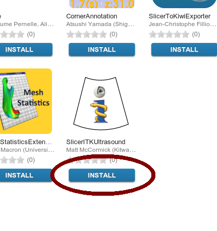

Installation
============

Install via the `Slicer Extension Manager
<https://www.slicer.org/wiki/Documentation/Nightly/SlicerApplication/ExtensionsManager>`_
of the `3D Slicer <https://www.slicer.org/>`_ Nightly version:

1. Download, install, and run the 3D Slicer `Nightly Build <http://download.slicer.org/>`_
2. Select **View -> Extension Manager**
3. Hit the **INSTALL** button for *SlicerITKUltrasound*
4. Restart 3D Slicer
5. The modules will be present in the *Ultrasound* category

  Installation button in the Slicer Extension Manager
