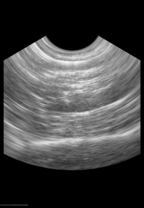

.. index:: Curvilinear array

.. include:: ScanConvertCurvilinearArray.rst

  Screenshot of the ScanConvertCurvilinearArray module output. If there
  are multiple frames in the volume's third dimension, each frame is scan
  converted.

  This output can be reproduced by running the ``ScanConvertCurvilinearArrayTest``
  test in the project repository. Example input data can be found `here
  <http://slicer.kitware.com/midas3/folder/3646>`_.
