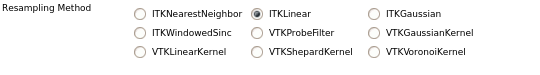

Scan Conversion
===============

.. index:: Scan conversion

Datasets can be processed in their acquired RF samples form, which preserves
full resolution without interpolation errors. Then, can be scan converted
(resampled) with these modules for further analysis, registration, analysis,
or visualization.

Data is scan converted from a specializations of the
`itk::SpecialCoordinatesImage
<https://itk.org/Doxygen/html/classitk_1_1SpecialCoordinatesImage.html>`_ data
structure to the rectilinear grid `itk::Image
<https://itk.org/Doxygen/html/classitk_1_1Image.html>`_ data structure.  The
*itk::SpecialCoordinatesImage* derived classes represent data obtained
from a curvilinear array probe, phased array 3D probe, or a series of
adjacent, non-overlapping, 2D slices. Sampled as an *itk::Image*, more image
processing and visualizations capabilities are available, but this data
structure is also the natural representation of data from a linear array
probe.

Resampling Methods
------------------

.. index:: Resampling

Multiple resampling algorithm implementations are available across all the
scan conversion modules. These algorithms vary in performance and accuracy
characteristics. They should be selected based on performance requirements and
behavior for the probe's geometry and image contents.

  All resampling methods are available in the three probe geometry scan
  conversion modules. Select the desired resampling method with the button in
  the above section.

The ITK methods use the `itk::ResampleImageFilter
<https://itk.org/Doxygen/html/classitk_1_1ResampleImageFilter.html>`_ while
the VTK methods use the `vtkProbeFilter
<http://www.vtk.org/doc/nightly/html/classvtkProbeFilter.html>`_ or the
`vtkPointInterpolator
<http://www.vtk.org/doc/nightly/html/classvtkPointInterpolator.html>`_.

**ITKLinear**
  Tri-linear interpolation with the `itk::LinearInterpolateImageFunction
  <https://itk.org/Doxygen/html/classitk_1_1LinearInterpolateImageFunction.html>`_.
  This is the default method.

**ITKNearestNeighbor**
  Nearest-neighbor interpolation with the
  `itk::NearestNeighborInterpolateImageFunction
  <https://itk.org/Doxygen/html/classitk_1_1NearestNeighborInterpolateImageFunction.html>`_.

**ITKGaussian**
  Interpolation with a Gaussian kernel with the
  `itk::GaussianInterpolateImageFunction
  <https://itk.org/Doxygen/html/classitk_1_1GaussianInterpolateImageFunction.html>`_.

**ITKWindowedSinc**
  Windowed-sinc interpolation with a 3 sample radius Lanczos window using the
  `itk::WindowedSincInterpolateImageFunction
  <https://itk.org/Doxygen/html/classitk_1_1WindowedSincInterpolateImageFunction.html>`_.

**VTKProbeFilter**
  Interpolation using the `vtkProbeFilter
  <http://www.vtk.org/doc/nightly/html/classvtkProbeFilter.html>`_.

**VTKVoronoiKernel**
  Nearest-neighbor-like interpolation using the
  `vtkVoronoiKernel <http://www.vtk.org/doc/nightly/html/classvtkVoronoiKernel.html>`_.
  The kernel uses points within a radius of :math:`2.1 * maxOutputVoxelSpacing`.

**VTKLinearKernel**
  Kernel-based interpolation averaging all points with
  `vtkLinearKernel <http://www.vtk.org/doc/nightly/html/classvtkLinearKernel.html>`_.
  The kernel uses points within a radius of :math:`2.1 * maxOutputVoxelSpacing`.

**VTKShepardKernel**
  Kernel-based interpolation with weights defined by :math:`1 / r^2` with the
  `vtkShepardKernel <http://www.vtk.org/doc/nightly/html/classvtkShepardKernel.html>`_.
  The kernel uses points within a radius of :math:`2.1 * maxOutputVoxelSpacing`.

**VTKGaussianKernel**
  Kernel-based interpolation with a Gaussian kernel using the
  `vtkGaussianKernel <http://www.vtk.org/doc/nightly/html/classvtkGaussianKernel.html>`_.
  The kernel uses points within a radius of :math:`2.1 * maxOutputVoxelSpacing`.

Probe Geometries
----------------

.. toctree::
  :maxdepth: 2

  CurvilinearArray
  PhasedArray3D
  SliceSeries
